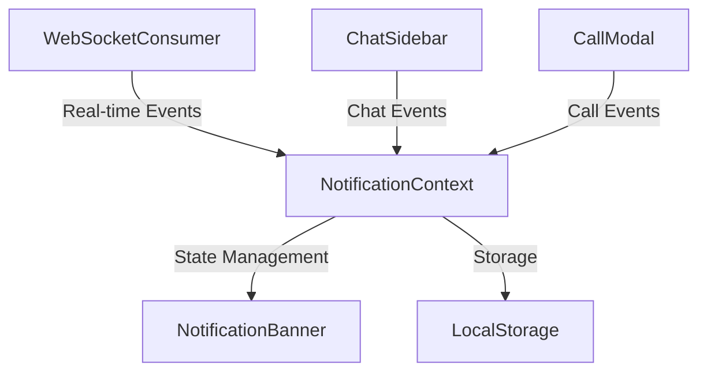
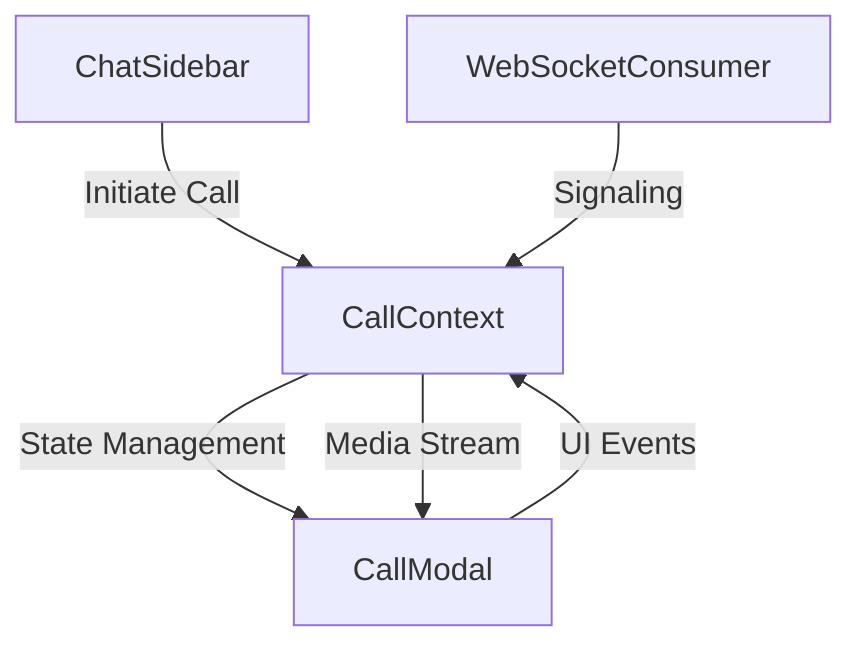
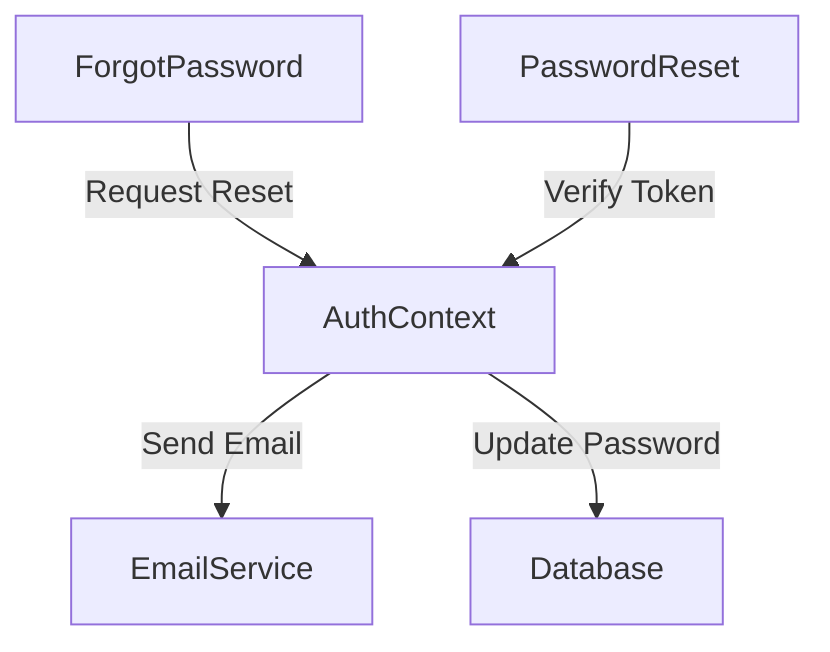
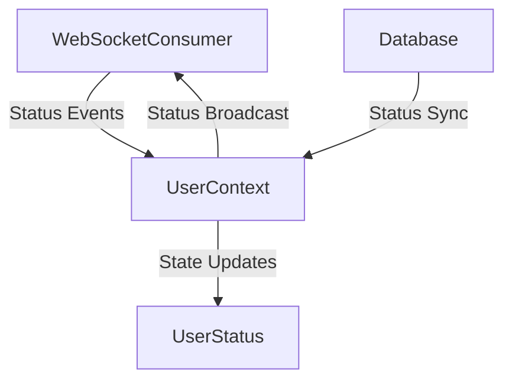
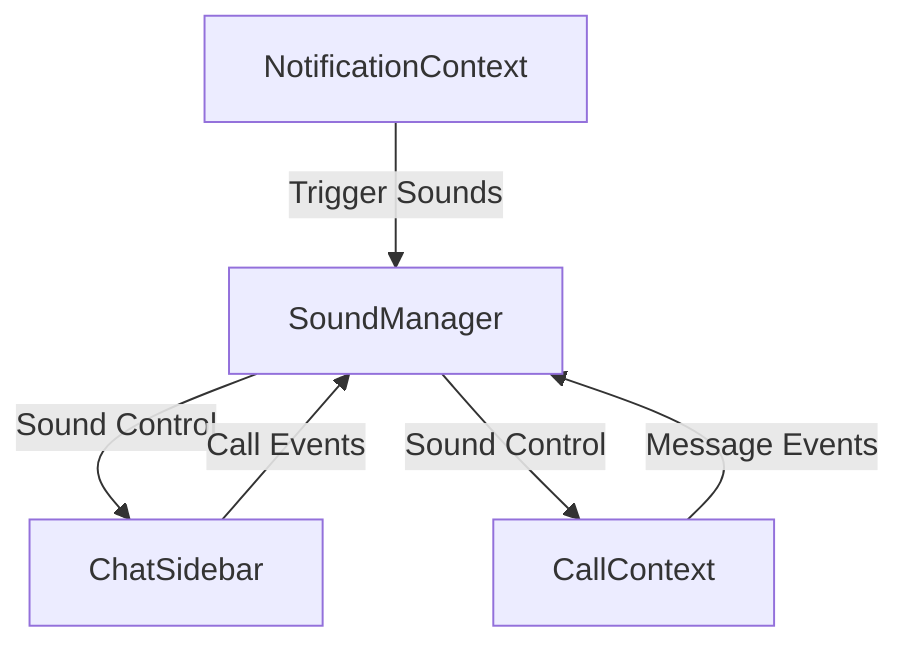

# Singularity Express - Recent Improvements and Bug Fixes

## Overview
This document outlines the recent improvements and bug fixes implemented in the Singularity Express application. These changes focus on enhancing user experience, fixing critical bugs, and improving the overall reliability of the application.

## Table of Contents
1. [Console Error Fixes](#console-error-fixes)
2. [Notification System Improvements](#notification-system-improvements)
3. [Global Video Call Modal](#global-video-call-modal)
4. [Password Recovery System](#password-recovery-system)
5. [Online/Offline Status System](#onlineoffline-status-system)
6. [Audio Notification System](#audio-notification-system)

## Console Error Fixes
### Changes Made
- Resolved various console errors related to WebSocket connections
- Fixed state management issues in React components
- Addressed memory leaks in video call components
- Cleaned up event listener management

### Technical Details
- Implemented proper cleanup in `useEffect` hooks
- Added error boundaries for better error handling
- Improved WebSocket connection management
- Enhanced state synchronization between components

## Notification System Improvements
### Components Involved
- `NotificationContext.jsx`: Central notification management
- `NotificationBanner.jsx`: UI component for displaying notifications
- `ChatSidebar.jsx`: Handles chat-specific notifications
- `WebSocketConsumer`: Backend component for real-time notifications

### Changes Made
1. **Persistent Storage**
   - Notifications now persist in local storage
   - Implemented offline notification queue
   - Added notification synchronization on reconnection

2. **Notification Types**
   - Chat messages
   - Call notifications
   - System notifications
   - Friend request notifications

### Component Relationships

## Global Video Call Modal
### Components Involved
- `CallModal.jsx`: Global modal component
- `CallContext.jsx`: Call state management
- `ChatSidebar.jsx`: Call initiation
- `WebSocketConsumer`: Call signaling

### Changes Made
1. **Global Accessibility**
   - Moved call modal to root level
   - Implemented context-based state management
   - Added persistent call state

2. **Modal Features**
   - Video/audio controls
   - Call status display
   - Connection quality indicators
   - Responsive design

### Component Relationships

## Password Recovery System
### Components Involved
- `ForgotPassword.jsx`: Password recovery UI
- `PasswordReset.jsx`: Reset password form
- `AuthContext.jsx`: Authentication management
- `EmailService`: Backend email service

### Changes Made
1. **Recovery Flow**
   - Email-based password reset
   - Secure token generation
   - Time-limited reset links
   - Password validation

2. **Security Features**
   - Token expiration
   - Rate limiting
   - Secure password requirements
   - Email verification

### Component Relationships

## Online/Offline Status System
### Components Involved
- `UserStatus.jsx`: Status display component
- `WebSocketConsumer`: Real-time status updates
- `UserContext.jsx`: User state management
- `Database`: Status persistence

### Changes Made
1. **Status Management**
   - Real-time status updates
   - Status persistence
   - Last seen tracking
   - Status indicators

2. **Features**
   - Automatic status updates
   - Manual status override
   - Status history
   - Status synchronization

### Component Relationships

## Audio Notification System
### Components Involved
- `SoundManager.jsx`: Audio management
- `ChatSidebar.jsx`: Call and message sounds
- `NotificationContext.jsx`: Sound triggers
- `CallContext.jsx`: Call-specific sounds

### Changes Made
1. **Sound Types**
   - Incoming call ringtone
   - New message notification
   - Call end sound
   - System notification sound

2. **Sound Management**
   - Proper sound cleanup
   - Volume control
   - Sound queuing
   - Mute functionality

### Component Relationships

## Technical Implementation Details

### WebSocket Integration
- Real-time event handling
- Connection state management
- Automatic reconnection
- Event queuing for offline mode

### State Management
- Context-based state management
- Local storage synchronization
- State persistence
- Cross-component communication

### Security Considerations
- Secure WebSocket connections
- Token-based authentication
- Rate limiting
- Input validation

### Performance Optimizations
- Efficient re-rendering
- Resource cleanup
- Memory leak prevention
- Optimized media handling

## Testing
- Unit tests for critical components
- Integration tests for WebSocket functionality
- End-to-end testing for user flows
- Performance testing for media handling

## Future Improvements
1. Enhanced error handling
2. Additional notification types
3. Improved offline support
4. Advanced call features
5. Better performance monitoring

## Getting Started
To understand and work with these improvements:

1. Review the component relationships
2. Understand the context-based state management
3. Familiarize with the WebSocket implementation
4. Study the notification system architecture
5. Review the audio management system

## Contributing
When working with these components:
1. Maintain the established patterns
2. Follow the component relationships
3. Use the provided contexts
4. Implement proper cleanup
5. Add appropriate error handling

## Support
For questions or issues:
1. Review the component documentation
2. Check the WebSocket implementation
3. Consult the state management patterns
4. Review the audio system documentation
5. Contact the development team 